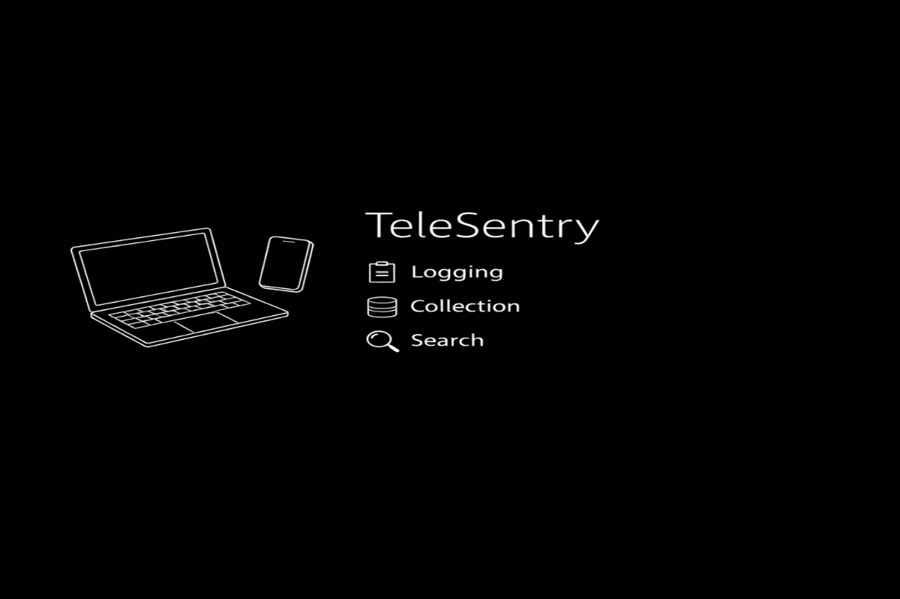
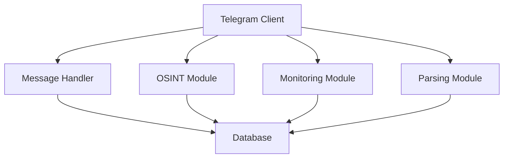

# TeleSentry




Advanced Telegram monitoring bot with OSINT capabilities, message tracking, and security features.


## Key Features

- **Message Monitoring** - Track deleted messages and self-destructing media

- **Profile Monitoring** - Detect changes in user profiles and avatars

- **OSINT Tools** - Search by username, phone number, and email

- **User Parsing** - Collect and analyze user data from chats

- **Global Search** - Find chats and channels by keywords

- **Content Downloading** - Download videos from YouTube and TikTok

- **Security Features** - Device masking and rate limiting


## Requirements

- Python 3.8+

- Telegram API credentials (get from [my.telegram.org](https://my.telegram.org/))

- API keys for OSINT services (optional)


## Installation


### 1. Install Dependencies

```bash

pip install -r requirements.txt
```

### 2. Configure API Credentials
```bash
Edit models/config.py:
```

# Telegram API credentials
```bash
api_id = YOUR_API_ID  # Get from my.telegram.org

api_hash = 'YOUR_API_HASH'  # Get from my.telegram.org
```

# Admin IDs (get your ID with /myid command)
```bash
ADMIN_IDS = [YOUR_USER_ID]
```

# Notification and log chat IDs
```bash
NOTIFY_CHAT_ID = [-100YOUR_CHAT_ID]  # Group ID for notifications

LOG_CHAT_ID = [-100YOUR_CHAT_ID]  # Group ID for logs
```

### 3. Configure OSINT API Keys (Optional)


# API keys for OSINT services
```bash
INTELX_API_KEY = "your_intelx_api_key"  # Get from https://intelx.io/

LEAKLOOKUP_API_KEY = "your_leaklookup_api_key"  # Get from https://leak-lookup.com/

LEAKIX_API_KEY = "your_leakix_api_key"  # Get from https://leakix.net/
```


### Usage
```bash
python main.py
```


### Main Commands

Monitoring Commands

 • `/logg_user chat_id [user_id]` - Start logging user messages
 
 • `/stoplogg chat_id [user_id]` - Stop logging
 
 • `/export_logs chat_id` - Export chat logs to CSV
 
 • `/monitoring` - Manage profile monitoring
 
 • `/profile user_id` - Get user profile snapshot
 
 • `/avatar_history user_id` - Show user's avatar history

OSINT Commands

 • `/username_search username` - Search accounts by username
 
 • `/number_user +79991234567` - Search by phone number
 
 • `/email_search email@example.com` - Search by email

Parsing Commands

 • `/pars all_uss @channel` - Collect user data from channel
 
 • `/parsmsg @channel user_id limit` - Collect user messages
 
 • `/invite @chat_username` - Invite users from CSV
 
 • `/msgcopy message_link` - Copy message from protected chat

Global Search

 • `/search_ch keyword` - Global search for chats
 
 • `/export_search keyword` - Export search results
 
 • `/clear_search keyword` - Clear search results

Admin Commands

 • `/deleted` - Show last deleted messages
 
 • `/viewonce` - Show saved self-destructing media
 
 • `/media` - Show all saved media
 
 • `/stats` - Show statistics
 
 • `/delete_text_logsstats` - Delete text logs
 
 • `/delete_media` - Delete media files
 
 • `/cleardb` - Clear user database


### Technical Details

# Architecture




# Security Features

 • **Device Masking** - Emulates different device types to avoid detection
 • **Rate Limiting** - Prevents API flooding with configurable delays
 • **Error Handling** - Automatic cooldown after consecutive errors
 • **Session Security** - Secure session management

Data Storage

 • SQLite database for structured data
 • CSV files for parsed user data
 • Text logs for deleted messages
 • Media files storage for attachments


Configuration Options

 • **DEVICE_SETTINGS** - Customize device fingerprint
 • **rate_limits** - Adjust request delays and limits
 • **SECURITY_SETTINGS** - Configure security parameters
 • **media_folder** - Set custom media storage location
 • **txt_logs_folder** - Set custom logs storage location


### Workflow

# Message Monitoring

 1 Bot receives incoming message
 2 Message is cached in memory
 3 If message is deleted, it's saved to database
 4 Notification is sent to configured chat
 5 Self-destructing media is automatically saved

Profile Monitoring

 1 Admin adds user to monitoring list
 2 Bot periodically checks user profile
 3 Changes are detected and logged
 4 Notifications are sent about profile changes
 5 Avatar changes are tracked and saved


Troubleshooting

 • Connection issues: Check Telegram API credentials
 • Rate limit errors: Increase delay settings in config
 • Storage issues: Clean up old media and log files
 • Permission errors: Verify admin IDs in config
 • OSINT errors: Check API keys and service availability
